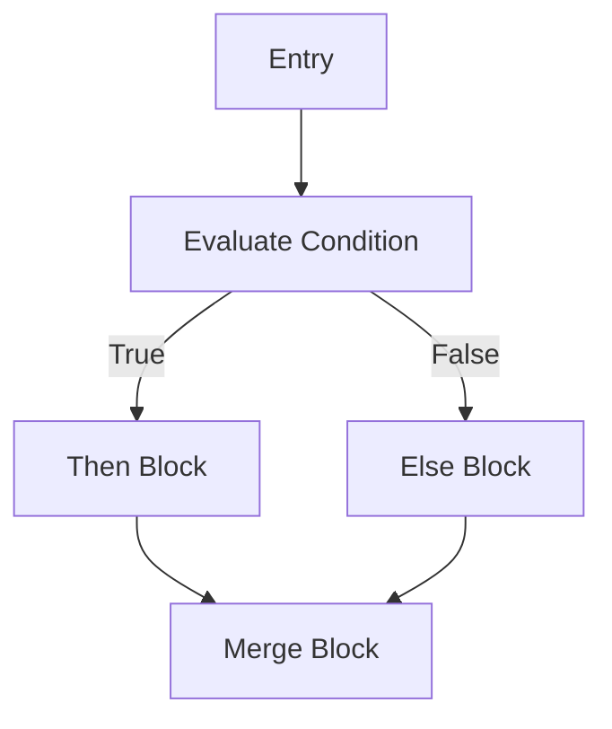

# Technical Specification Framework: Nova Compiler

This document serves as the formal technical specification and framework architecture for the Nova Compiler. It outlines the algorithmic complexities, memory models, data structures, and the exact order of execution within the compilation pipeline.

---

## 1. System Architecture Framework

The compiler is structured into a rigorous three-tier architecture (Frontend, Middle-end, Backend) emphasizing modular decoupling.

### 1.1 Frontend (Analysis Phase)
* **Lexical Scanner (`lexer.c`)**: Tokenizes the character stream using a deterministic finite automaton (DFA) approach.
* **Syntax Parser (`parser.c`)**: Utilizes a Top-Down Recursive Descent Parsing framework with $O(N)$ expected time complexity for non-ambiguous LL(1) grammars.

### 1.2 Middle-end (Synthesis & IR Phase)
* **Semantic Analyzer (`semantic.c`)**: Performs static analysis via Abstract Syntax Tree (AST) traversal. Implements a Stack-based Symbol Table using linked lists for $O(1)$ scope pushing/popping and $O(K)$ lookup (where $K$ is depth).
* **IR Emitter (`codegen.c`)**: Translates AST nodes into LLVM Intermediate Representation (IR). Adheres strictly to Static Single Assignment (SSA) form by leveraging LLVM's Memory-to-Register promotion passes implicitly.

### 1.3 Backend (Emission Phase)
* **Target Machine Code Generator**: Utilizes LLVM's `TargetMachine` APIs to perform architecture-specific instruction selection, register allocation, and `.o` object file emission.

---

## 2. Technical Execution Order

When the compiler driver (`main.c`) is invoked, the execution follows this strict technical lifecycle:

1. **I/O Initialization**: The source file is fully buffered into heap memory using `fread` to minimize disk I/O interrupts.
2. **Lexical Bootstrapping**: `lexer_init()` binds the source buffer to the global lexer state pointers.
3. **AST Construction**: `parse_program()` is invoked. The parser requests tokens via `lexer_next_token()` sequentially, allocating `ASTNode` structures on the heap via `ast_create_node()`.
4. **Symbol Table Initialization**: `semantic_analyze()` makes a pre-pass to register all function signatures (resolving forward declarations), followed by a deep traversal to validate block scopes and type coercions.
5. **LLVM Context Initialization**: `codegen_init()` boots the LLVM context, module, and `IRBuilder`. It defines external standard library linkages (e.g., `printf`).
6. **IR Generation Pass**: `codegen_program()` traverses the type-checked AST. Variables map to `LLVMBuildAlloca`, and control flow maps to `LLVMBuildCondBr`.
7. **Basic Block Termination Check**: The IR generator structurally enforces block terminators (`ret` instructions) to prevent UB (Undefined Behavior) during LLVM verification passes.
8. **Object Emission**: `codegen_emit_object()` resolves the host OS Target Triple, configures the `TargetMachine`, and flushes the module to disk as a binary ELF/COFF object file.
9. **Memory Teardown**: `codegen_cleanup()` and `ast_free()` are invoked, recursively freeing the AST tree and LLVM contexts to ensure zero memory leaks.

---

## 3. Core Data Structures & Memory Management

### 3.1 Abstract Syntax Tree (AST)
The AST utilizes a heavily unionized structure to optimize CPU cache-line hits. Instead of polymorphic structs requiring virtual tables or excessive casting, memory is tightly packed.

```c
typedef struct ASTNode {
    ASTNodeType type; // 4 bytes (enum)
    union {           // Size determined by largest struct (approx 24-32 bytes)
        struct { char* name; DataType var_type; struct ASTNode* initializer; } let_stmt;
        struct { OperatorType op; struct ASTNode* left; struct ASTNode* right; } binop;
        struct { struct ASTNode* condition; struct ASTNode* then_branch; struct ASTNode* else_branch; } if_stmt;
        struct { int value; } number;
        // ...
    } data;
} ASTNode;
```
* **Memory Lifecycle**: Allocated dynamically during `parse_*`. Released via a post-order traversal in `ast_free()`.

### 3.2 Symbol Table Environment
The Semantic Analyzer uses an intrusive linked-list to model scope environments.
* **Push**: $O(1)$ allocation, bound to the head.
* **Lookup**: $O(N)$ linear scan from innermost to outermost scope.
* **Teardown**: Scopes are sequentially popped and freed upon exiting a block.

---

## 4. LLVM API Integration & SSA Form

The compiler leverages the `llvm-c` API framework. Since LLVM IR strictly enforces **Static Single Assignment (SSA)**, local variable mutation is handled via memory allocation rather than direct register reassignment.

### 4.1 Variable Binding Framework
1. **Declaration (`AST_LET`)**: 
   * Call `LLVMBuildAlloca(builder, type, name)` -> Yields `LLVMValueRef` (pointer).
   * Call `LLVMBuildStore(builder, init_value, pointer)`.
2. **Access (`AST_IDENTIFIER`)**:
   * Retrieve pointer from environment.
   * Call `LLVMBuildLoad2(builder, type, pointer, name)` to extract the value.

### 4.2 Control Flow Graph (CFG) Framework
For branching operations (`if`/`while`), the framework explicitly manages Basic Blocks to construct the CFG.

**If-Statement CFG Mapping:**

* LLVM API Calls: `LLVMAppendBasicBlockInContext`, `LLVMBuildCondBr`, `LLVMPositionBuilderAtEnd`.

---

## 5. Build Framework & Toolchain Specs
* **Standard**: C11 Standard (ISO/IEC 9899:2011)
* **Compiler**: GCC 15+ / Clang 18+
* **Build System Generator**: CMake 3.10+
* **LLVM Target Version**: LLVM 21.x
* **Linkage Model**: Links statically/dynamically against `libLLVM` and the C++ Standard Library (`stdc++`) to resolve LLVM's internal C++ implementation dependencies.
